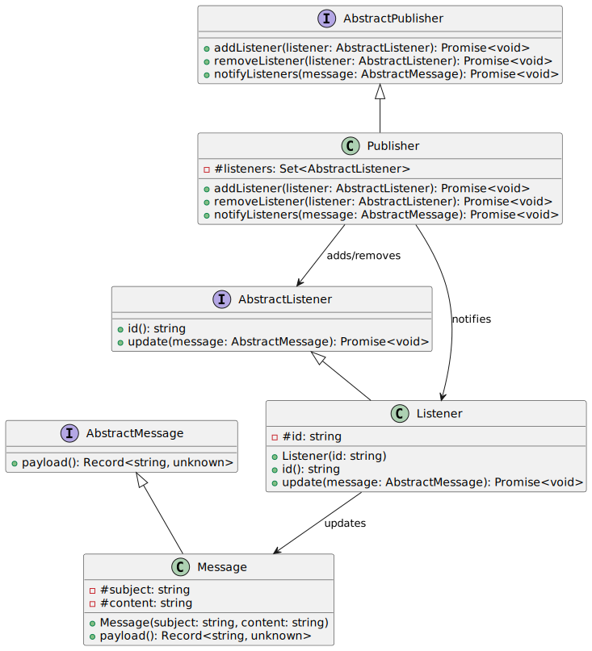
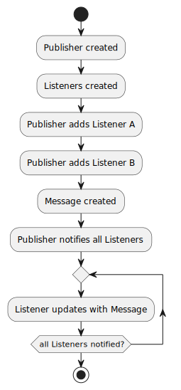

# observer-pattern-js

I wrote this repo to show how I would implement the observer pattern in JavaScript, it also includes an implementation written in TypeScript.

You can read the [full blog post here](https://lucdev.net/blog/observer-pattern-javascript/).

## Diagrams





## Usage

You need to have Node.js installed.

```bash
npm install
```

To run the JavaScript implementation:

```bash
npm run start:js
```

To run the TypeScript implementation:

```bash
npm run start:ts
```

## License

Released under the public domain, see [LICENSE](LICENSE).
